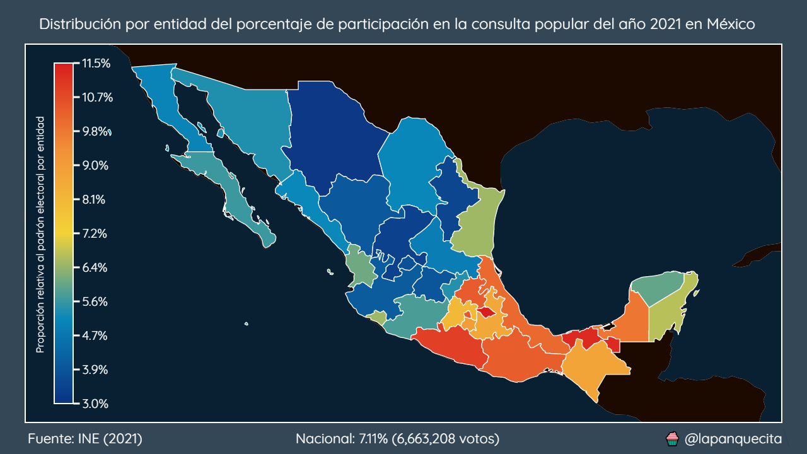
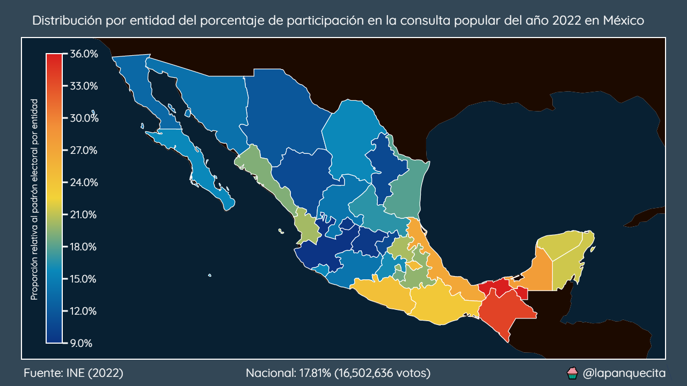

# Consultas populares en México

Hasta la fecha de escribir este artículo el INE ha organizado dos consultas populares en México.

La primera, en el año 2021 tenía comoo propósito el iniciar una investigación judicial para determinar si los actores políticos del pasado habián cometido crímenes.

La segunda, en el año 2022 tenía como propósito la terminación de funciones del titular del poder Ejecutivo.

Ambas consultas necesitan un mínimo del 40% de participación a nivel nacional para ser vinculantes. En ambos casos la participación fue mucho menor a la requerida.

En este repositorio vamos a analizar los datos proporcionados por el INE.

## Consulta popular 2021

## Consulta popular 2022

